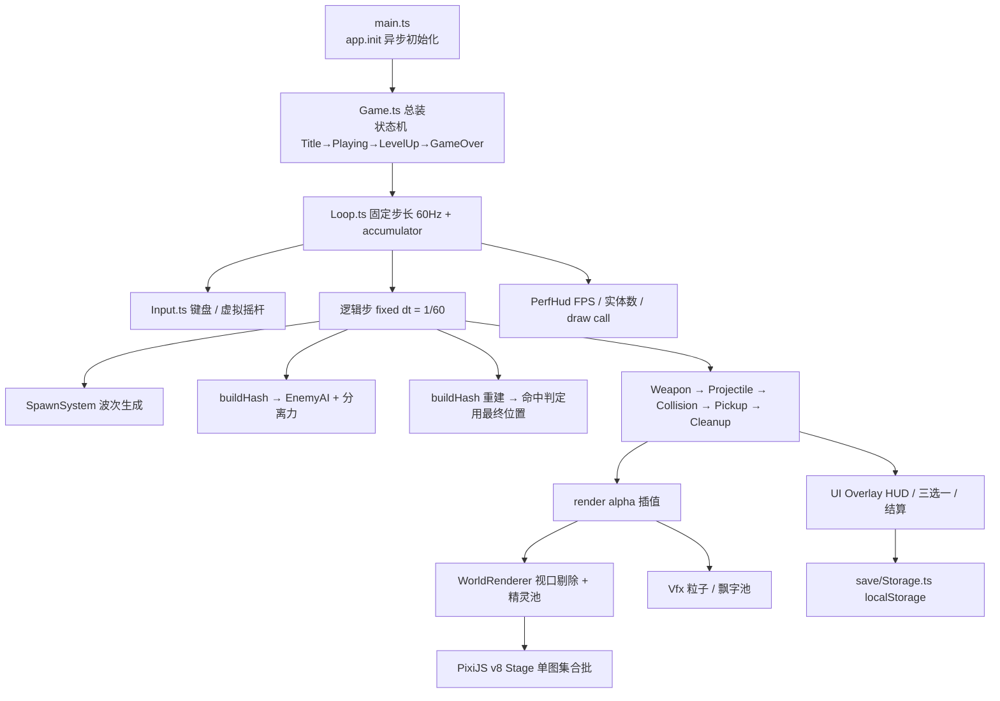

# Hollow Depths · 幽墟幸存者

> 纯前端、零后端的浏览器幸存者类 Roguelite。打开链接即玩，无需下载、无需注册、没有冷启动。

**[在线游玩 →](#)（部署后填写）**

一个 Vite + TypeScript + PixiJS v8 从零实现的 Vampire Survivors 风格游戏：控制游侠在无限地牢中走位求生，武器自动开火，击杀掉落灵魂碎片，升级时三选一构筑属于这一局的流派。10 分钟内经历 3 场 Boss 战，12 分钟结算。

---

## 目录

- [玩法与内容](#玩法与内容)
- [在线试玩](#在线试玩)
- [技术栈](#技术栈)
- [架构设计](#架构设计)
- [五个关键技术难点](#五个关键技术难点)
- [工程决策记录](#工程决策记录)
- [本地开发](#本地开发)
- [部署](#部署)
- [性能数据](#性能数据)
- [项目结构](#项目结构)
- [后续计划](#后续计划)

---

## 玩法与内容

| 操作 | 桌面端 | 移动端 |
| --- | --- | --- |
| 移动 | `W` `A` `S` `D` / 方向键 | 左半屏任意位置按下并拖动（虚拟摇杆） |
| 攻击 | 自动 | 自动 |
| 暂停 | `Esc` / `P` | 右下角按钮 |

**角色**：游侠 Ranger —— HP 100，移速 1.0×，起始武器「裂地印记」，固有被动「拾荒者」（拾取范围 +20%）。

**武器（7 把，最多装备 6 把）**

| 武器 | 机制 |
| --- | --- |
| 裂地印记 | 在敌人脚下撕裂大地，延迟 0.6s 后爆发（起始武器） |
| 圣环 | 光球环绕自身旋转，持续灼烧并击退 |
| 追猎印记 | 自动锁定最近敌人的追踪符文 |
| 震击波 | 以自身为中心爆发，强力击退，被围时解围 |
| 碎星弹 | 向四周散射碎片，成型后清潮极快 |
| 贯穿光束 | 朝最近敌人射出贯穿光柱 |
| 霜噬领域 | 原地凝结寒霜，减速并持续侵蚀 |

**被动装备（8 件，最多装备 6 件）**：疾风符（攻速）、轻履靴（移速）、双面镜（投射物数量）、狂怒石（伤害）、生命符（生命上限 + 回复）、护心甲（护甲）、智慧卷轴（经验）、锐锋石（暴击）。

**进化（7 组）**：武器满级 + 指定被动 → 双生圣环 / 猎杀连锁 / 瞬息震荡 / 星陨暴雨 / 苍穹裂光 / 寒霜随行 / 深渊裂隙。

**敌人**：5 种普通怪（蚁群、亡魂、史莱姆、幻影、漩涡虫）+ 3 种精英（分裂魔、甲壳兽、欺诈者）+ 3 个 Boss（古神 5:00 / 灾厄 8:00 / 终焉 10:00）。每种敌人有独立 AI：蓄力冲刺、持续成长、随机瞬移、螺旋接近、定期分裂、护盾减伤、受击闪现。

**波次节奏**

| 时间 | 事件 |
| --- | --- |
| 0:00 | 蚁群 + 亡魂 |
| 1:00 | 史莱姆加入 |
| 2:00 | 幻影加入，密度 ×1.5 |
| 3:00 | 漩涡虫加入 |
| 4:00 | 首个精英 |
| 5:00 | **Boss 1 古神** |
| 6:00 | 欺诈者加入，密度 ×2 |
| 8:00 | **Boss 2 灾厄** |
| 10:00 | **Boss 3 终焉** |
| 12:00 | 结算 |

---

## 在线试玩

部署后直接访问即可，**没有加载等待页之外的任何步骤**。

> 兼容 Chrome / Edge / Firefox / Safari 最新版，需要 WebGL。Canvas 渲染失败时会给出明确提示而不是白屏。

---

## 技术栈

| 层 | 选型 | 理由 |
| --- | --- | --- |
| 构建 | Vite 5 + TypeScript 5（strict） | 与团队既有前端工程同一套约定（`moduleResolution: bundler` / `noEmit`），秒级冷启动与 HMR |
| 渲染 | **PixiJS v8**（锁定 `8.20.1`） | WebGL 2D 批渲染，同屏数千精灵仍能合批；v8 的异步初始化与新 Graphics API 带来更好的类型安全 |
| 架构 | 自研轻量 ECS（约 120 行） | 幸存者类只需要「实体 + 若干系统顺序遍历」，引入第三方 ECS 库收益低于成本，自研更好控也更好讲 |
| UI | DOM 覆盖层 + 手写 CSS | 只有 4 个静态面板，DOM 做文本排版、按钮、无障碍、移动端安全区成本远低于 Canvas 内自绘；不引框架以保证首屏体积 |
| 状态 | `localStorage` | 无后端，仅存最佳记录与设置 |
| 素材 | **程序化生成的图集** | 用 Graphics 画出全部精灵后烘焙进单张 RenderTexture：零网络请求、零版权风险、单 BaseTexture 便于合批 |
| 部署 | Render Static Site | 见下方「为什么用静态站」 |

**明确的取舍**：不引入 React/Vue（只有 4 个静态面板，YAGNI）；不引入物理引擎（只需圆-圆碰撞 + 分离力，自研 30 行）；不引入第三方 ECS（同上）。

---

## 架构设计

分层：数据层（纯配置）→ 核心层（循环 / 输入 / 池 / 空间哈希 / 随机）→ ECS 层（World + System）→ 渲染层（相机 / 剔除 / 特效）→ UI 层（DOM）→ 存档层。



**系统顺序是固定且有讲究的**：

```
Input → Spawn → buildHash → EnemyAI(含分离力) → buildHash(重建)
      → Weapon → Projectile → Collision → Pickup → Cleanup → Vfx
```

空间哈希在一步内构建两次：第一次供 AI 的分离力使用（可以容忍上一帧位置），第二次在全部位移完成后重建，保证碰撞判定用的是本帧最终坐标。两次都是 O(n)，代价远低于命中判定失准带来的手感问题。

---

## 五个关键技术难点

### 1. 固定步长 60Hz + 渲染插值

`Loop.ts` 以恒定 1/60 秒推进逻辑，渲染帧用 `alpha` 对位置插值：

```ts
this.acc += frameDt;
while (this.acc >= STEP && steps < MAX_STEPS) {
  this.onFixed(STEP);   // dt 恒为 1/60
  this.acc -= STEP;
}
this.onRender(this.acc / STEP, frameDt);  // alpha ∈ [0,1)
```

- 60 / 120 / 144Hz 显示器上的移动速度、冷却、弹道**完全一致**；
- 单帧最多追 5 步，超出直接丢弃时间——宁可慢放，也不要卡顿雪崩；
- `visibilitychange` 时重置时间基准，切回前台不会瞬间追帧。

### 2. 空间哈希网格（把 O(n²) 降到近 O(n)）

2000 个敌人 × 数百投射物，朴素两两检测是百万级运算/帧，必卡。

`SpatialHash.ts` 用**桶哈希 + 计数排序**：

- 格边长 64px ≈ 2× 最大普通敌人半径，一次查询只需遍历 3×3 邻格；
- 4096 个固定桶，内存不随世界范围增长，`clear()` 只是一次 `TypedArray.fill`；
- 构建用两趟计数排序（O(n)），比 `Map<number, Entity[]>` 快一个量级；
- 全部使用预分配的 `Int32Array` / `Float32Array`，**运行期零 `new`**；
- `stamp` 标记解决「不同格哈希到同一桶导致实体被重复返回」的问题。

同一份网格还被**分离力**复用，不额外构建。

### 3. 对象池：运行期零分配

敌人（2600）、投射物（1600）、拾取物（1100）、粒子（700）、飘字（26）全部预分配。

```ts
spawn()      // 取一个（可能是复用对象，调用方必须完整初始化）
releaseAt(i) // 末尾交换 + count--，保持密集存储
```

密集存储带来两个好处：遍历时内存连续（缓存友好），以及回收时无需维护空闲链表。
热路径上禁止 `new`、闭包捕获、`map/filter`——全部索引 `for` 循环，避免 GC 抖动造成的周期性掉帧。

### 4. 分离力：让怪潮既可怖又可读

没有分离力时，几百只怪会重叠成一个点：既看不清来了什么，也让命中判定失去意义。

复用空间哈希查询邻居，对重叠的敌人施加排斥力：

```ts
const push = (minD - dd) / minD;   // 重叠越深，推力越大
sx += (ox / dd) * push;
```

Boss 只受 12% 的推力——它应该推着小怪走，而不是被小怪推着走。

### 5. 图集合批 + 视口剔除

- 全部精灵由代码程序化绘制后**烘焙进单张 RenderTexture**，共享一个 BaseTexture ⇒ 可以合进极少的 draw call；
- 精灵一次性预创建并挂在容器上，屏外实体只置 `visible = false`。相比频繁 `addChild/removeChild`，没有场景图结构变化的开销，而 PixiJS 会跳过不可见对象；
- 剔除边距 72px，避免精灵在视口边缘突然弹出。

---

## 工程决策记录

### 为什么前端用静态站（零冷启动）

本项目**没有后端**：没有账号、没有排行榜、没有跨设备存档，构建产物只是一堆静态文件。

Render 的免费档里，**Free Web Service 15 分钟无流量会休眠，唤醒需要数十秒**（冷启动）。对一个「面试官点开链接就要看到东西」的作品集来说，这几十秒是致命的——面试官很可能直接关掉。

而 **Static Site 由 CDN 边缘节点直接分发，没有休眠概念，也不存在冷启动**。因此本项目选用 `runtime: static` + `staticPublishPath: dist`，构建产物带 content hash 并配 `Cache-Control: immutable` 长缓存，HTML 入口设为 `no-cache` 保证发版即时生效。

### 为什么排行榜要异步加载（不阻塞关键路径）

v2 计划加全球排行榜，届时会用 Cloudflare Workers + KV 提供接口。设计上有两条硬约束：

1. **游戏本体不能依赖它**。排行榜请求走 `fetch` 且失败静默降级，无论接口是否可用，游戏都能正常开局。
2. **不在关键路径上**。请求在标题页才开始发起，不与首屏渲染、图集烘焙、资源加载争抢带宽与主线程。

这样即使排行榜服务超时或不可用，玩家（和面试官）看到的仍然是秒开的游戏本体。

### 为什么素材用代码生成而不是外部图集

- 零网络请求、零版权风险（无需署名，可自由商用）；
- 首屏体积从「几百 KB 图片」降到接近 0；
- 单张 atlas 天然合批；
- 改一个颜色只需改一行代码，迭代速度快。

---

## 本地开发

```bash
npm install
npm run dev        # http://localhost:5176
npm run build      # tsc --noEmit && vite build → dist/
npm run preview    # 预览构建产物
npm run typecheck  # 仅类型检查
```

要求 Node.js ≥ 18。

---

## 部署

项目根目录已包含 `render.yaml`（Render Blueprint）：

```yaml
services:
  - type: web
    name: hollow-depths
    runtime: static
    branch: main
    buildCommand: npm ci && npm run build
    staticPublishPath: dist
```

步骤：

1. 推送代码到 GitHub；
2. Render 控制台 → **New** → **Blueprint** → 连接该仓库；
3. 确认 `staticPublishPath: dist`、`NODE_VERSION: 20`，点 Apply；
4. 每次 `git push` 到 `main` 自动触发重新构建与部署。

也可以手动创建：New → Static Site，Build Command 填 `npm ci && npm run build`，Publish Directory 填 `dist`。

---

## 性能数据

按 `~` 打开「性能面板」按钮可看到实时数据（页面上点击「性能面板」开关）：

| 指标 | 目标 | 实测 |
| --- | --- | --- |
| 同屏 2000+ 敌人 | ≥ 60 fps | 见性能面板 `FPS / 敌人 / draw` |
| 首屏资源体积 | < 3 MB | **约 630 KB 未压缩 / gzip 后约 190 KB** |
| draw call | 越少越好 | 单图集使全部精灵合批 |

性能面板同时显示 `step`（上一帧执行的逻辑步数）——如果它长期 > 1，说明 CPU 追不上 60Hz，是性能瓶颈的直接信号。

---

## 项目结构

```
hollow-depths/
├── index.html                 单页入口（canvas 容器 + UI 覆盖层 + 加载遮罩）
├── render.yaml                Render Blueprint（静态站点）
├── src/
│   ├── main.ts                app.init() → 构建 Game → 启动；WebGL 失败的兜底提示
│   ├── style.css              UI 层样式（暗黑地牢奇幻 / 玻璃拟态）
│   ├── core/
│   │   ├── Game.ts            总装：状态机 + 系统编排 + UI 联动 + 结算
│   │   ├── Loop.ts            固定步长 60Hz + accumulator 插值
│   │   ├── Input.ts           键盘 + 移动端虚拟摇杆
│   │   ├── Build.ts           武器/被动槽位、属性重算、三选一与进化
│   │   ├── ObjectPool.ts      密集数组对象池
│   │   ├── SpatialHash.ts     桶哈希 + 计数排序的空间网格
│   │   ├── Rng.ts             可 seed 的 mulberry32
│   │   └── MathUtil.ts        数学与格式化工具
│   ├── ecs/
│   │   ├── World.ts           世界容器（三个实体池 + 空间哈希 + 玩家）
│   │   ├── Components.ts      扁平实体结构定义
│   │   ├── Damage.ts          伤害计算、范围爆发、玩家受伤
│   │   ├── Spawn.ts           实体生成辅助（统一重置默认字段）
│   │   └── systems/           Spawn / EnemyAI / Weapon / Projectile / Collision / Pickup / Cleanup
│   ├── render/
│   │   ├── Textures.ts        程序化图集（Graphics 绘制 → 烘焙单张 RenderTexture）
│   │   ├── Renderer.ts        地板平铺 + 精灵池 + 视口剔除 + 插值同步
│   │   ├── Camera.ts          平滑跟随 + 震屏
│   │   └── Vfx.ts             粒子与伤害飘字对象池
│   ├── data/                  纯配置：characters / weapons / passives / enemies / waves
│   ├── ui/                    Hud / TitleScreen / LevelUpModal / GameOverScreen / PerfHud
│   └── save/Storage.ts        localStorage（含异常容错）
```

**新增一把武器只需要两步**：在 `data/weapons.ts` 加一条配置 + 一个 `fire()` 实现，引擎代码一行不用改。敌人、被动、波次同理。

---

## 后续计划

- [ ] 增加角色（代码审查员 / 值班运维 / 实习生）与解锁条件
- [ ] 全球排行榜（Cloudflare Workers + KV，前端异步加载、失败静默降级）
- [ ] WebAudio 合成音效（不引入音频文件，避免首屏体积膨胀）
- [ ] 第二套皮肤（太空），与现有皮肤资源目录隔离、标题页切换
- [ ] 更细的移动端适配与手柄支持

---

## 许可

代码与美术资源（程序化生成）均可自由使用。
